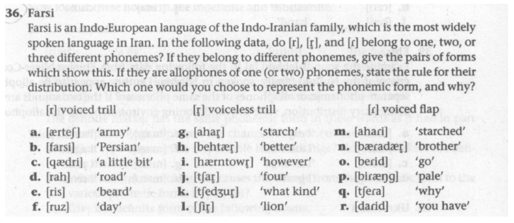
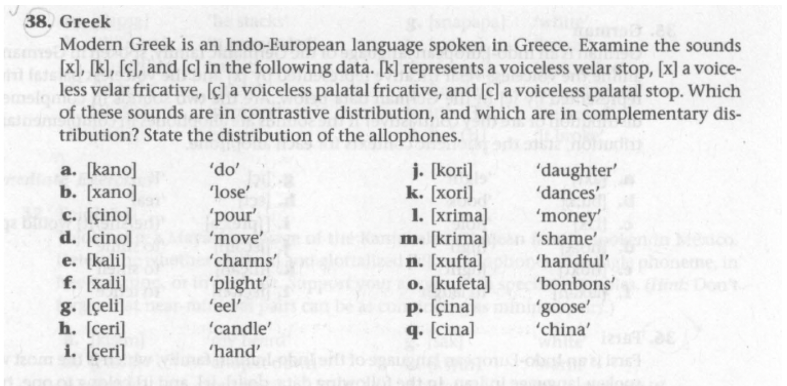
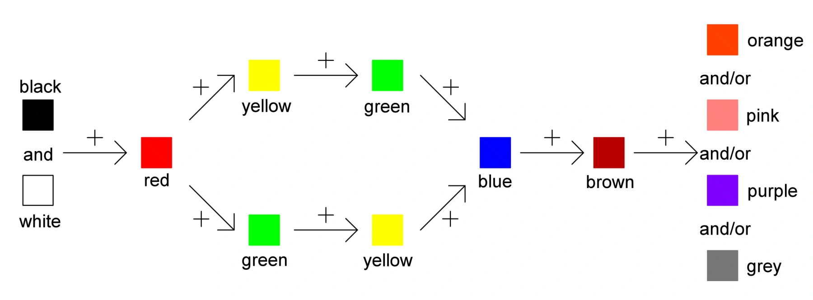
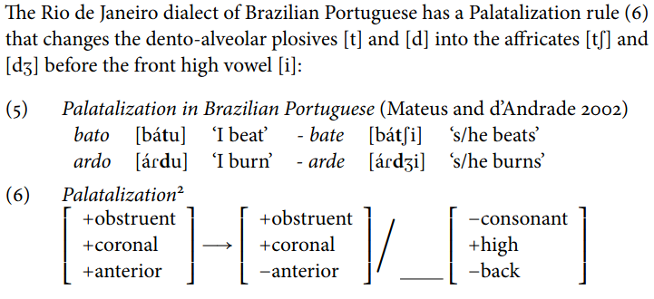
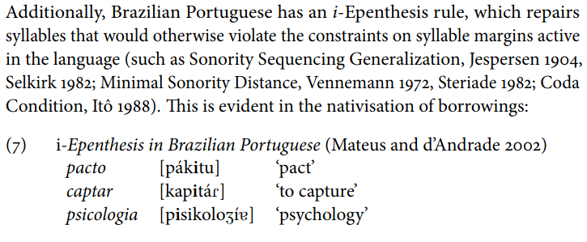
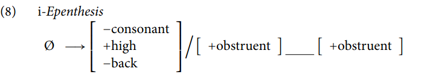
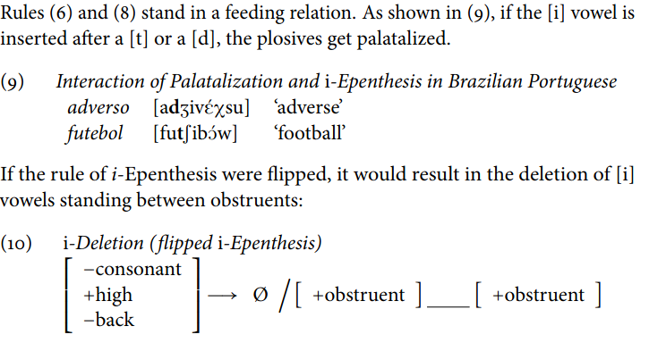

```{r preamble, echo=FALSE, message=FALSE, warning=FALSE}
library(dplyr)
library(ggplot2)
```


<br><br><br><br>
<div class="warning" style='padding:0.1em; background-color:#E9D8FD; color:#69337A'>
<span>
<p style='margin-top:1em; text-align:center'>
<b>Què és un fonema?</b><br><b>Què és un al·lòfon?</b>
</p>
</p></span>
</div>

---

# Regles fonològiques

Quina regla regeix la distribució dels sons relacionats amb /ɾ/?

* *pintar* [pinta]

* *pintaré* [pintaɾe]

* *pintar* amb mi [pinta:m:i]

* *córrer* [korə]

* *correrà* [korəɾa]

--

.Large[
## /ɾ/ ➔ ∅ / ___`#`
]

---

# Regles fonològiques

La relació entre entitats fonèmiques (abstractes) i fonètiques (concretes) pot ser descrita amb regles fonològiques

Representen el coneixement fonològic d'un parlant nadiu

## X ➔ Y / C ___ D


---

# Classes naturals (de nou)

<br><br><br><br>
<div class="warning" style='padding:0.1em; background-color:#E9D8FD; color:#69337A'>
<span>
<p style='margin-top:1em; text-align:center'>
<b>Què és una classe natural?</b>
</p>
</p></span>
</div>

---

# Classes naturals + regles

.pull-left[
* *seat* [sit]

* *loot* [lut]

]

.pull-right[
* *seated* [siɾəd]

* *looted* [luɾəd] 

]

---

# Classes naturals + regles

.pull-left[
* *seat* [sit]

* *loot* [lut]

* *seed* [sid]

]

.pull-right[
* *seated* [siɾəd]

* *looted* [luɾəd] 

* *seeded* [siɾəd]

]


---

# Classes naturals + regles 

## /t,d/ ➔ [ɾ] / stressed vowel ___ unstressed vowel

.footnote[
***
sit vs. seated; seed vs. seeded]

--

<br><br>

## /-voiced, +alveolar, +stop/ ➔ [ɾ] / stressed vowel ___ unstressed vowel


---

# Tipus de regles

**Assimilació**: 
--
/n/ adopta el punt d’articulació del consonant
que el segueix (p.e., *handbag*)

--

**Dissimilació**: 
--
[bɹ̩zɹk]  vs [bəzɹ̩k] 

--

**Inserció**: 
--
/sC/ ➔ [esC] / `#`__ (castellà)

--

**Elisió**: 
--
/ð/ ➔ ∅ /V__V (castellà) 

--

**Metàtesi**: 
--
/əs/ ➔ [sə] / __ [s] (català: *es sap* --> *se sap*)

--

**Afebliment (Lenició)**: 
--
/ætəm/ ➔ [æɾm̩] (angl.)

--

**Enfortiment**: 
--
/d/ ➔ [t] / __ `#` (català) [madrit]

---

Inventari de símbols per escriure regles:

https://jmfontana.github.io/ipa-chart-phono-rules/phonology/keyboard/index.html


---



---




---

# Lleis implicatives

* Si una llengua té un fonema menys comú, en general també té el seu homòleg més comú (p.e., ã ➔ a)

--

* Dins d'una llengua, els sons més comuns tenen una distribució més àmplia que els sons menys comuns

--

* Els nens adquireixen sons més comuns abans (p.e., [ɾ] vs. [r])

--

* Els sons menys comuns solen ser menys estables amb el temps

---

<br><br><br><br>
<div class="warning" style='padding:0.1em; background-color:#E9D8FD; color:#69337A'>
<span>
<p style='margin-top:1em; text-align:center'>
<b>Coneixes regles lingüístiques implicatives fora de la fonètica/fonologia?</b>
</p>
</p></span>
</div>

---



.footnote[
***
Colour Hierarchy Diagram (after Berlin and Kay 1969)]


---

# Greenberg's language universals

See:
https://en.wikipedia.org/wiki/Greenberg%27s_linguistic_universals

---

class: inverse

# Preguntes sobre fonètica o fonologia?

17/05: 1er exercici pràctic

---


class: inverse

# Preguntes sobre 2a practica de fonologia?


---

class: inverse

# Més sobre fonètica i fonologia

.pull-left[
* síl·labes

* suprasegmentals

* L2, L3, ...

* feeding; bleeding
]

.pull-right[

* animals

* música

* ...

]


---





---





---


How do you pronounce *adverso* or *futebol*?

--




---

class: inverse
# Propera sessió

* Practica 2: Fonologia

* Qüestionari de lectura (morfologia 1a)


***

* **Processos morfològics. L’estructura interna de les paraules i el significat.**
