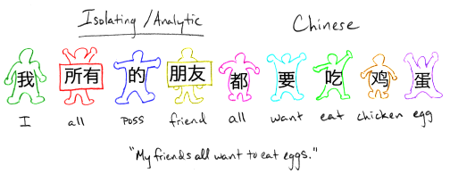
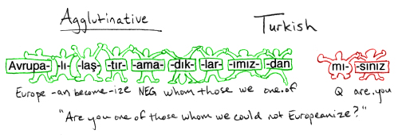
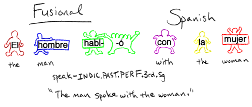
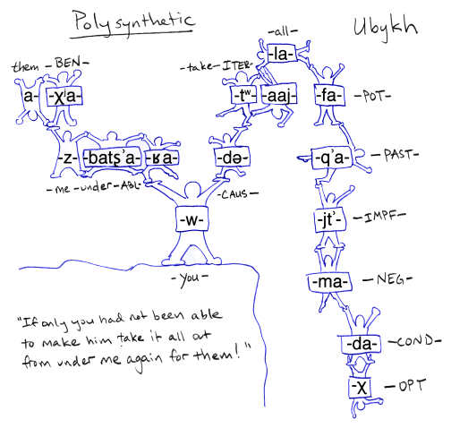
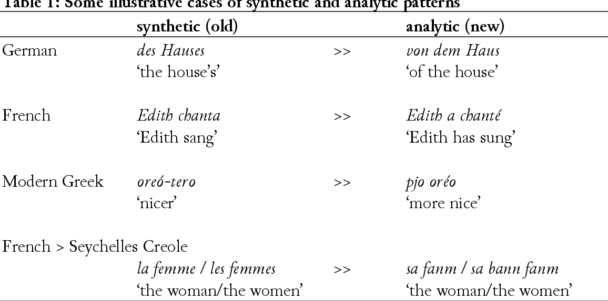
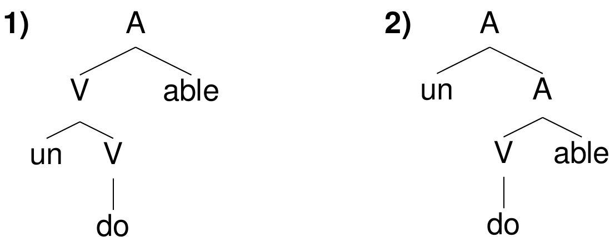
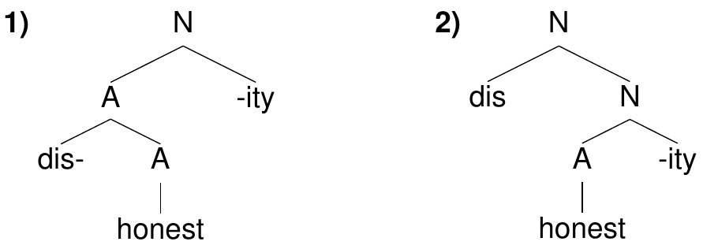

```{r preamble, echo=FALSE, message=FALSE, warning=FALSE}
library(dplyr)
library(ggplot2)
```

# Avui

*  La naturalesa del lèxic

*  Processos morfològics

* Tipus de llengües segons la seva morfologia


---

<br><br><br><br>
<div class="warning" style='padding:0.1em; background-color:#E9D8FD; color:#69337A'>
<span>
<p style='margin-top:1em; text-align:center'>
<b>Què estudia la morfologia?</b>
</p>
</p></span>
</div>

---

# La naturalesa del lèxic

[Morfema:]() Mínima unitat significativa

***

--

*taula*: taula

*nena*: nen- + -a

*entaularse*?


---

# La naturalesa del lèxic

[Morfema:]() Mínima unitat significativa

Hi ha diferents tipus de morfemes

* [lliures]() (free) vs. [lligats]() (bound)

***

--

gos vs. (gos)-set

large vs. (larg)-er


---

# La naturalesa del lèxic

[Morfema:]() Mínima unitat significativa

Hi ha diferents tipus de morfemes

* [lliures]() (free) vs. [lligats]() (bound)

* Subtipus
  * [arrel]() (root)
  
  * [radical]() (stem)
  
  * [afixos](): sufixos, prefixos, infixos


---

# La naturalesa del lèxic

[Morfema:]() Mínima unitat significativa

Hi ha diferents tipus de morfemes

* [lliures]() (free) vs. [lligats]() (bound)

* Subtipus
  * [arrel]() (root)
  
  * [radical]() (stem)
  
  * [afixos](): sufixos, prefixos, infixos

Hi ha diferents tipus pel que fa al significat:

* [“de contingut”]() (content) (inclou derivació)

* [funcional]() (inclou inflexió)


---

<br><br><br><br>
<div class="warning" style='padding:0.1em; background-color:#E9D8FD; color:#69337A'>
<span>
<p style='margin-top:1em; text-align:center'>
<b>Quines classes de paraules (parts of speech) coneixes?</b><br><br>
<b>Totes les llengües tenen les mateixes classes de paraules?</b>
</p>
</p></span>
</div>

---

<br><br><br><br>
<div class="warning" style='padding:0.1em; background-color:#E9D8FD; color:#69337A'>
<span>
<p style='margin-top:1em; text-align:center'>
<b>A la fonologia tenim al·lofons; en la morfologia al·lomorfs. Llavors, en analogia, què son al·lomorfs?
</p>
</p></span>
</div>

---

#Processos morfològics


* [Afixació](): re-cosir, recent-ment, un-fucking-believable, ne...pas

--

* [Composició](): cobrellit

--

* [Reduplicació](): She likes-likes him.

--

* [Alternança]() (Diàtesi): sing/sang/sung

--

* [Supleció](): good/better/best, bad/worse

---

# Tipus de llengües segons la seva morfologia

* [Analítiques](): molt poc o gens d’afixació. (Mandarí)



.footnote[
***
This and following graphics from: [https://allthingslinguistic.com/post/50939757945/morphological-typology-illustrations-from](https://allthingslinguistic.com/post/50939757945/morphological-typology-illustrations-from)

]
---

# Tipus de llengües segons la seva morfologia

* [Sintètiques](): afixació: arrels, radicals + morfemes lligats
  * [Aglutinants](): aquesta morfologia és més transparent i
probablement n’hi ha més a cada paraula (Hongarès)

  * [Fusionants](): aquesta morfologia és menys transparent i
n’hi ha menys a cada paraula (Català)

---


# Tipus de llengües segons la seva morfologia

* [Sintètiques](): afixació: arrels, radicals + morfemes lligats

  * [Aglutinants](): aquesta morfologia és més transparent i
probablement n’hi ha més a cada paraula (Hongarès)




---

# Tipus de llengües segons la seva morfologia

* [Sintètiques](): afixació: arrels, radicals + morfemes lligats

  * [Fusionants](): aquesta morfologia és menys transparent i
n’hi ha menys a cada paraula (Català)



---


# Tipus de llengües segons la seva morfologia

* [Polisintètiques](): fins i tot morfemes que són lliures a les llengües sintètiques poden ser lligats (Sora)
---

# Tipus de llengües segons la seva morfologia
* [Polisintètiques](): fins i tot morfemes que són lliures a les llengües sintètiques poden ser lligats (sora)




---

# Tipus de llengües segons la seva morfologia

* [Analítiques](): molt poc o gens d’afixació. (Mandarí)

* [Sintètiques](): afixació: arrels, radicals + morfemes lligats
  * [Aglutinants](): aquesta morfologia és més transparent i
probablement n’hi ha més a cada paraula (Hongarès)
  * [Fusionants](): aquesta morfologia és menys transparent i
n’hi ha menys a cada paraula (Català)

* [Polisintètiques](): fins i tot morfemes que són lliures a les llengües sintètiques poden ser lligats (sora)

---




.footnote[
***
Source: Haspelmath & Michaelis (2017): Analytic and synthetic: Typological change in varieties of European languages

cf. *Der Dativ ist dem Genitiv sein Tod* vs. *Der Dativ ist der Tod des Genitivs* vs. *Der Dativ ist des Genitivs Tod*
]

---
# L’estructura de les paraules

* L’estructura de les paraules, igual que la sintaxi, és jeràrquica.

*  La jerarquia reflecteix com es componen els significats dels
morfemes.

* Els morfemes normalment es combinen amb una categoria morfosintàctica concreta.

*  Ambigüetat d’estructura pot produir ambigüetat de significat.


---

# Exemple 1

*undoable*: 1) que es pot desfer. 2) que no es pot fer.

--



---

# Exemple 2

*dishonesty*: **significat?**


---

# Exemple 2

*dishonesty*: La qualitat de ser deshonest.

--




---

# Anàlisi jeràrquica de les paraules amb afixos

* Pas 1: Identificar els morfemes;

--

* Pas 2: Identificar l'arrel i la seva categoria (nom, verb, etc.);

--

* Pas 3: Pels afixos al costat de l'arrel, identifica la categoria
amb la qual es combinen, i el resultat;

--

* Pas 4: Combina l'arrel amb l'afix que dóna el resultat que
permet seguir composant la paraula;

--

*  Pas 5: Repetir el procés amb la base ('stem') resultant fins
que la paraula està completament analitzada.

---

# Com identificar la categoria amb la qual es combina un afix


**-able**: Combina amb verbs per formar adjectius:

doable, readable, eatable
\*happyable, \*beautifulable, \*carable, \*dinnerable, \*overable

--

**-ity**: Es pot combinar amb adjectius per formar noms:

honesty, disnonesty, propensity, propensity, doability
\*womanity, \*importy, \*carable, \*dinnerable, \*overable

---
# Com identificar la categoria amb la qual es combina un afix

**dis-**: Es pot combinar amb adjectius per formar adjectius o amb
verbs per formar verbs:

dishonest, discontinuous, disadvantageous, discharge, disallow
\*diswoman, \*discar, \*carity, \*disyesterday

---
# Com identificar la categoria amb què combina un àfix

**un-**: Es combina amb verbs per formar nous verbs; vol dir aproximadament "el procés invers de V"

undo, unfold, unzip

--

**un-**: Es combina amb adjectius per formar nous adjectius; vol dir “no” / “el contrari de"

unhappy, unintelligent, unpainted, *unwoman

---

# Resolució de problemes morfològics

**Objectiu:** Identificar els morfemes i el seu significat, així com els processos fonològics que poden estar implicats en la formació de la paraula.

Exemple: en el suec *bilarna* = "cotxe"

Quina part de la paraula correspon al plural? Quina part a
l'article? Quina part a "cotxe"?

---

# Resolució de problemes morfològics

en bil = un cotxe

na = gènere no neutre

ar = plural


---

class: inverse
# Propera sessió

* No hi ha practica

* Qüestionari de lectura (morfologia 2a) abans de 23-05


***

* **Primera prova pràctica puntuable (fonètica i fonologia).**

La prova és amb paper i llapis. Pots portar un (1) full A4 amb apunts. Recomanació: Imprimeix el full de l'AFI i fes-ne els apunts.
