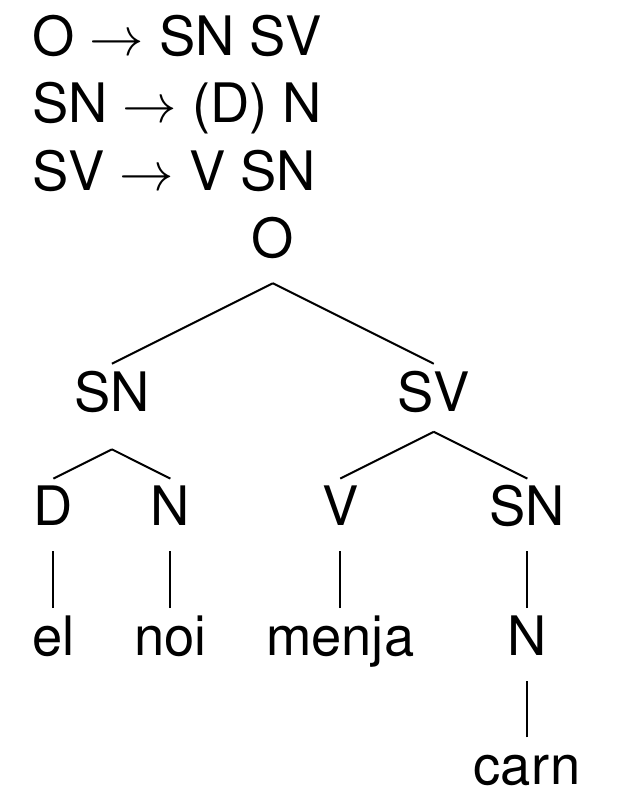

```{r preamble, echo=FALSE, message=FALSE, warning=FALSE}
library(dplyr)
library(ggplot2)
```

# Avui


* El lèxic

* Arbres d'estructura i regles


---

<br><br><br><br>
<div class="warning" style='padding:0.1em; background-color:#E9D8FD; color:#69337A'>
<span>
<p style='margin-top:1em; text-align:center'>
<b> Regles i arbres: Per què construïm gramàtiques?
 </b>
</p>
</p></span>
</div>

---

# Alguns per què

* Descripció lingüística (sintaxi, tipologia)

* Desenvolupament teòric (sintaxi, tipologia)

* Desenvolupament tècnic (PLN)

* Diagnòstic (dislèxia, aphàsies, ...)

* ...

---

# Disclaimer

* Cada tipus de descripció (per exemple, regles fonològiques o arbres sintàctics) estan lligades a suposicions

* Aquí, principalment; arbres binaris, excepte conjuncions, "a la Chomsky simplificat"


---

# El lèxic

* N $\rightarrow$ {gos, got, ganivet, ...}

* V $\rightarrow$ {corre, salta, estima, ...}

***

* N $\rightarrow$ gos

* N $\rightarrow$ got

* ...

---

<br><br><br><br>
<div class="warning" style='padding:0.1em; background-color:#E9D8FD; color:#69337A'>
<span>
<p style='margin-top:1em; text-align:center'>
<b>Especifica tres entrades lèxiques per categoria en la llengua de la teva elecció</b>
<br><br><br>

<li> Adj </li>
<li> Det </li>
<li> P </li>
<li> Adv </li>

</p>
</p></span>
</div>


---

# Frases (o sintagmes, o phrases)

* Cada paraula (forma+significat) d'una llengua pertany a una categoria lèxica

* La categoria lèxica determina quin tipus de frases pot formar

* Una frase funciona com una unitat dins d'una oració

* Cada frase té un cap (head) que és membre de la categoria lèxica d'aquesta frase (NP $\Rightarrow$ N)

---

<br><br><br><br>
<div class="warning" style='padding:0.1em; background-color:#E9D8FD; color:#69337A'>
<span>
<p style='margin-top:1em; text-align:center'>
<b>Dóna tres exemples de SNs (NPs), tres de SVs (VPs), i tres de SPs (PPs)</b>
</p>
</p></span>
</div>

---

# Recursivitat


---

<br><br><br><br>
<div class="warning" style='padding:0.1em; background-color:#E9D8FD; color:#69337A'>
<span>
<p style='margin-top:1em; text-align:center'>
<b>Què és una oració?</b>
</p>
</p></span>
</div>


---

# Regles

* X $\rightarrow$ Y Z

* X $\rightarrow$ Z

<br><br>

***

<br><br>

* S $\rightarrow$ NP VP

* NP $\rightarrow$ Det N

* NP $\rightarrow$ N


---

# Arbres i les regles d’estructura




---

# Com identificar-los

El noi [ [menja] [la carn] [amb una forquilla]].

--

* Substitució per un pronom: El noi la menja (amb una forquilla).

* Moviment: La carn sí que menja el noi (amb una forquilla).

* Preguntes: Què ha menjat el noi (amb una forqilla)? La carn.

---

# Barres (o apòstrofs)

* X' = X + something else functioning as a single X

* $\bar{X}$ = X'

<br><br>

***

* N' $\rightarrow$ Adj N

* *El gos groc gaudeix*


---

<br><br><br><br>
<div class="warning" style='padding:0.1em; background-color:#E9D8FD; color:#69337A'>
<span>
<p style='margin-top:1em; text-align:center'>
<b>Hi-ha més categories amb barretes que $\bar{N}$? </b>
</p>
</p></span>
</div>


---


<br><br><br><br>
<div class="warning" style='padding:0.1em; background-color:#E9D8FD; color:#69337A'>
<span>
<p style='margin-top:1em; text-align:center'>
<b>Especifica l'arbre sintàctic de les frases següents</b>
<br><br><br>

<li> El noi menja tofu.</li>
<li> El noi menja tofu i seitan.</li>
<li> Nosaltres som traductors joves.</li>
</p>
</p></span>
</div>

---


<br><br><br><br>
<div class="warning" style='padding:0.1em; background-color:#E9D8FD; color:#69337A'>
<span>
<p style='margin-top:1em; text-align:center'>
<b>Especifica l'arbre sintàctic de les frases següents</b>
<br><br><br>

<li> El noi menja tofu amb una forquilla. </li>
<li> El noi menja tofu amb una salsa. </li>
<li> Nosaltres som traductors de pel·lícules de Hollywood. </li>
</p>
</p></span>
</div>

---


<br><br><br><br>
<div class="warning" style='padding:0.1em; background-color:#E9D8FD; color:#69337A'>
<span>
<p style='margin-top:1em; text-align:center'>
<b>Especifica l'arbre sintàctic de les frases següents</b>
<br><br><br>

<li> The dog and the cat chased the burglar out of the house very quickly.</li>
<li> Som traductors joves.</li>
<li> Jo sóc una dona feliç i contenta.</li>
<li> L'escriptor que menysprea o ignora la tasca del gramàtic és un mal escriptor i un mal patriota.</li>

</p>
</p></span>
</div>


---

# Altres teories

* Arbres no binaris (p.e.: RRG)

* Tipus de operacions i "fixes" (p.e., PRO o (wh)-movement)

* Altres papers temàtics (p.e.: agent vs. undergoer)

* Altres tipus de dependències (p.e.: dependency grammar)


---

class: inverse
# Propera sessió 

* Dubtes sobre els continguts del curs  

* Més pràctica amb arbres

* Prova puntuable 1 (fonètica i fonologia)

***

* Segona prova pràctica puntuable (morfologia i sintaxi): 14/06

* Examen: 22/06