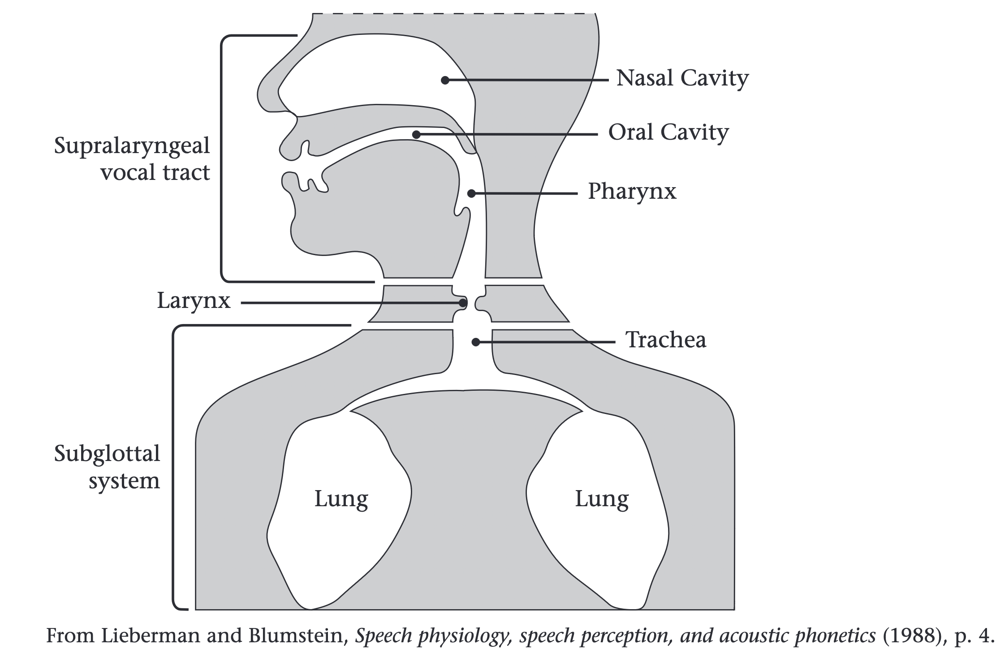
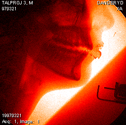
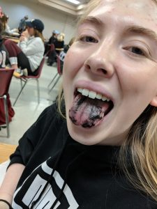
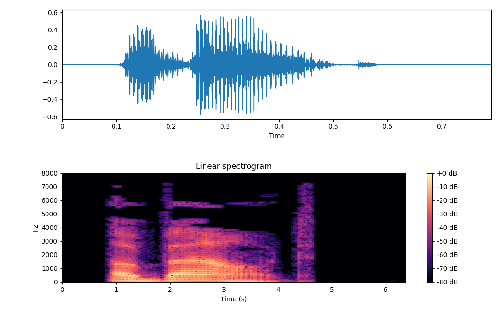
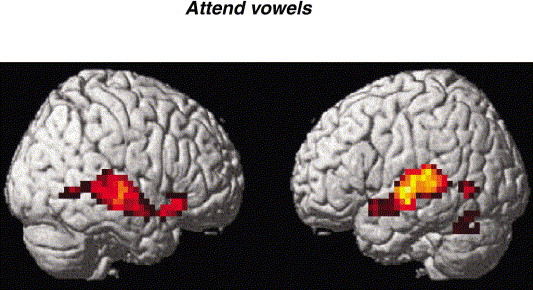
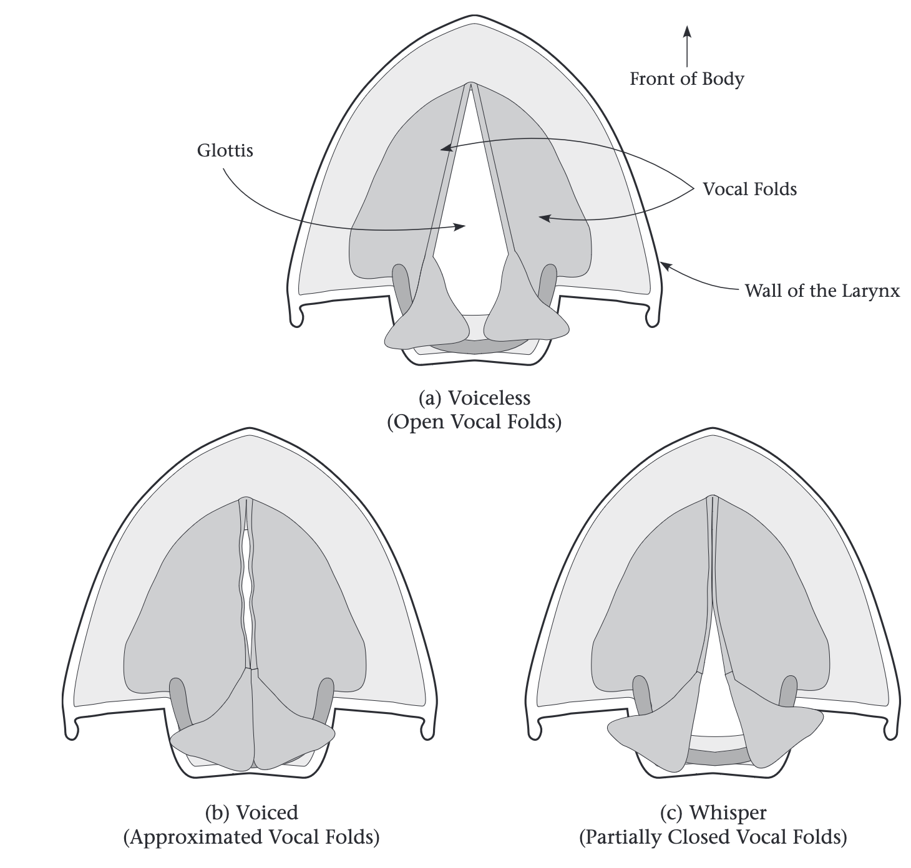
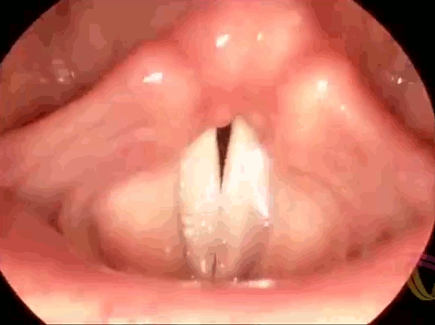
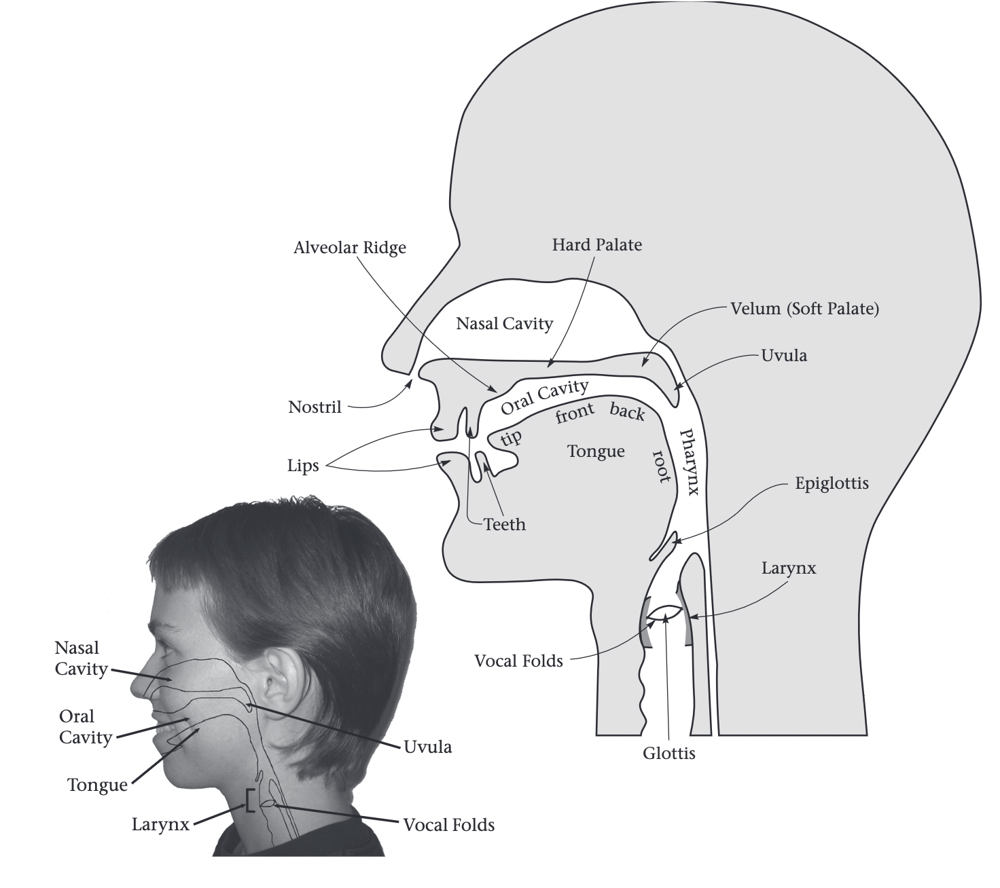
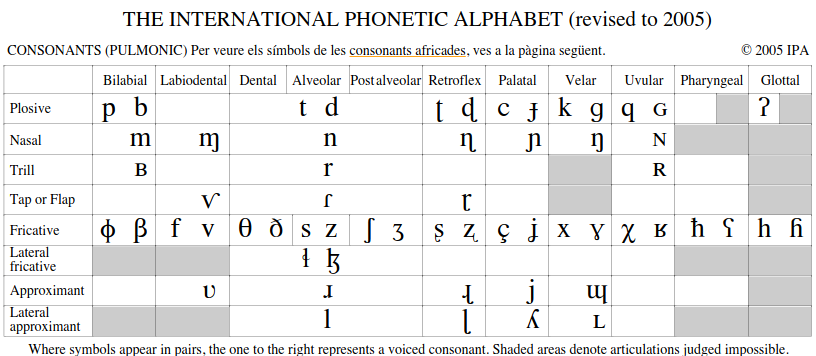
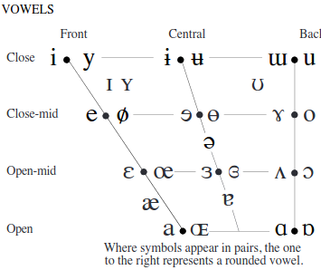

```{r preamble, echo=FALSE, message=FALSE, warning=FALSE}
library(dplyr)
library(ggplot2)
```


.large[

###  la fonètica és l'estudi de les unitats mínimes que componen el llenguatge

<br><br>
* **Fonètica articulatòria**<br>estudi de la producció dels sons de la parla

* **Fonètica acústica**<br>estudi de la transmissió i propietats físiques dels sons de la parla

* **Fonètica auditiva**<br>estudi de la percepció dels sons de la parla
]


---


<br><br><br><br>
<div class="warning" style='padding:0.1em; background-color:#E9D8FD; color:#69337A'>
<span>
<p style='margin-top:1em; text-align:center'>
<b>Com produïm sons?</b>
</p>
</p></span>
</div>


---



---


<br><br><br><br>
<div class="warning" style='padding:0.1em; background-color:#E9D8FD; color:#69337A'>
<span>
<p style='margin-top:1em; text-align:center'>
<b>Com produïm la paraula  &lt;gat>?</b>
</p>
</p></span>
</div>

---



.footnote[https://humans-who-read-grammars.blogspot.com/2018/04/x-rays-of-vocal-tracts.html]
---




.footnote[https://blogs.missouristate.edu/csd/2019/02/01/static-palatography-csd-210-tries-something-new-with-good-natured-reckless-abandon/]

---


<br><br><br><br>
<div class="warning" style='padding:0.1em; background-color:#ffc559; color:#000000'>
<span>
<p style='margin-top:1em; text-align:center'>
<b>Quines propietats físiques té la pronunciació de &lt;gat>?</b>
</p>
</p></span>
</div>

---



???
This is for acoustic phonetics

---

<br><br><br><br>
<div class="warning" style='padding:0.1em; background-color:#ffc559; color:#000000'>
<span>
<p style='margin-top:1em; text-align:center'>
<b>Com percebem el so?</b>
</p>
</p></span>
</div>

---



.footnote[The effects of attention on speech perception: An fMRI study. https://doi.org/10.1016/S0093-934X(02)00500-X]


---


# McGurk effect

* BBC clip<br> https://youtu.be/2k8fHR9jKVM

* McGurk for Spanish<br>https://youtu.be/F0nevYK5HIA

<br><br>
# Categorical perception

* [g] $\Rightarrow$ [t]

---

class: center, inverse

# Alfabet fonètic internacional (AFI/IPA)

---

<br><br><br><br>
<div class="warning" style='padding:0.1em; background-color:#E9D8FD; color:#69337A'>
<span>
<p style='margin-top:1em; text-align:center'>
<b>El mateix so?</b>
<br>
<br>

<li> &lt;m<b>o</b>lt> vs. &lt;c<b>o</b>bert> </li>
<br>
<li> &lt;<b>n</b>eu> vs. &lt;sa<b>n</b>g> </li>
<br>
<li> &lt;q<b>u</b>art> vs. &lt;s<b>u</b>c> </li>
<br>
<li> &lt;<b>r</b>uc> vs. &lt;mi<b>r</b>a> </li>
</p>
</p></span>
</div>


---

# Criteris per a un bon sistema de representació

.large[
1. Cada símbol només representa un so (phone/fon)
<br>
--
2. Cada so és només representat per un símbol
<br>(p. ex. &lt;cor> vs. &lt;quan> vs. &lt;llarg>)
<br>
--
<br>
2. Si dos sons poden distingir una paraula d'una altra, s'han de representar amb símbols diferents <br>(p. ex. &lt;sac> vs. &lt;sóc>)
]

---

# Consonants

1. sonorització (estat de la glotis)

2. lloc d'articulació

3. manera de articulació

---




---



.footnote[https://blogs.ubc.ca/mrpletsch/2019/04/03/the-respiratory-system-part-1-structures-and-mechanisms-of-breathing/]


---

* EN: &lt;sip> vs. &lt;zip>

* EN &lt;kill> vs. &lt;gill>

* CAT: &lt;drac> vs. &lt;terra>

* DE: &lt;Sonne> vs. &lt;wissen>

---




---

* **Bilabial**: pat, bat, mat, ...

* **Labiodental**: fat, vat, ...

* **Interdentals**: thigh, thy, ...

* **Alveolar**: tab, dab, sip, zip, ...

* **Post-alveolar**: judge, church, ...

* **Velar**: kill, gill, sing, ...

* **Glottal**: history (EN), la majoria de síl·labes alemanyes que comencen per vocal (*Oase*)... 

---

# I en català?

* **Bilabial**: 

* **Labiodental**: 

* **Interdentals**: 

* **Alveolar**: 

* **Post-alveolar**: 

* **Velar**: 

* **Glottal**: 

---

* **Stops**: prompt, boom, kale, ...

* **Fricatives**: foam, ship, zoom, ..

* **Affricates**: church, migdia, jutge, ...

* **Nasals**: meu, neu, sang, ...

* **Approximants**: llac, llave (CAST), ...

---



---


<br><br><br><br>
<div class="warning" style='padding:0.1em; background-color:#E9D8FD; color:#69337A'>
<span>
<p style='margin-top:1em; text-align:center'>
<b>Quina diferència hi ha entre una consonant i una vocal??</b>
</p>
</p></span>
</div>


---

# Vocals





---

* Vegeu Aula Global per el gràfic complet i per exemples en cast.; angl.; i cat.

* https://www.ipachart.com/

* Per als exercicis avaluats automàticament, utilitzeu la pàgina web per copiar/enganxar símbols

* Clicks: https://www.youtube.com/watch?v=WHHGOYu6Fl0

