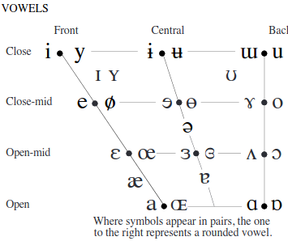
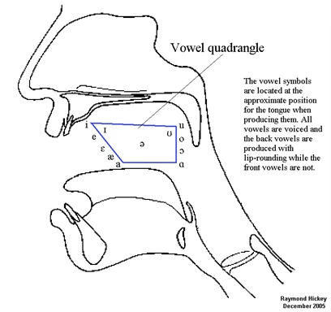
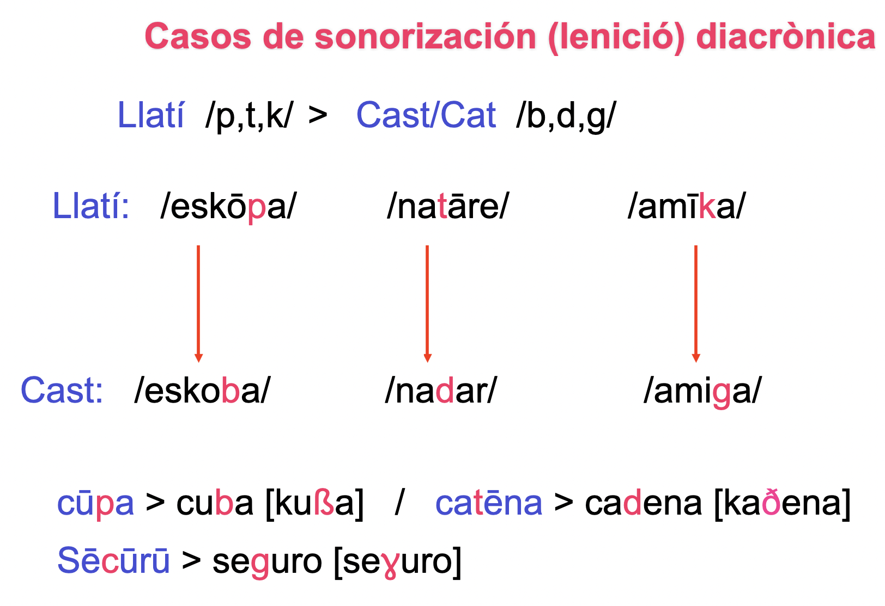
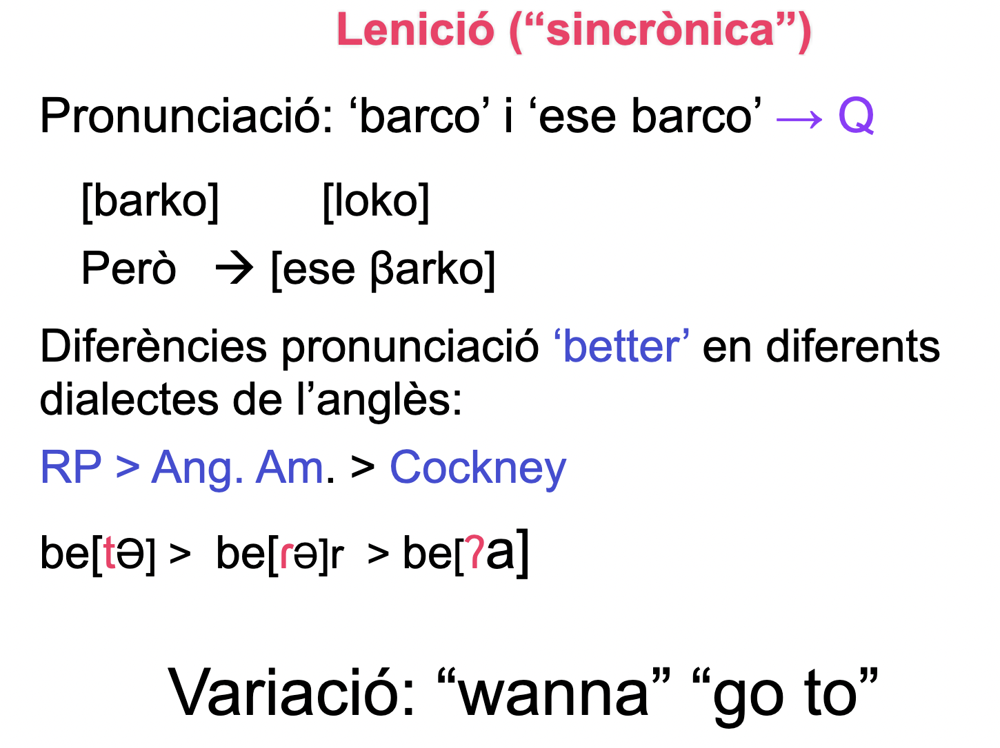
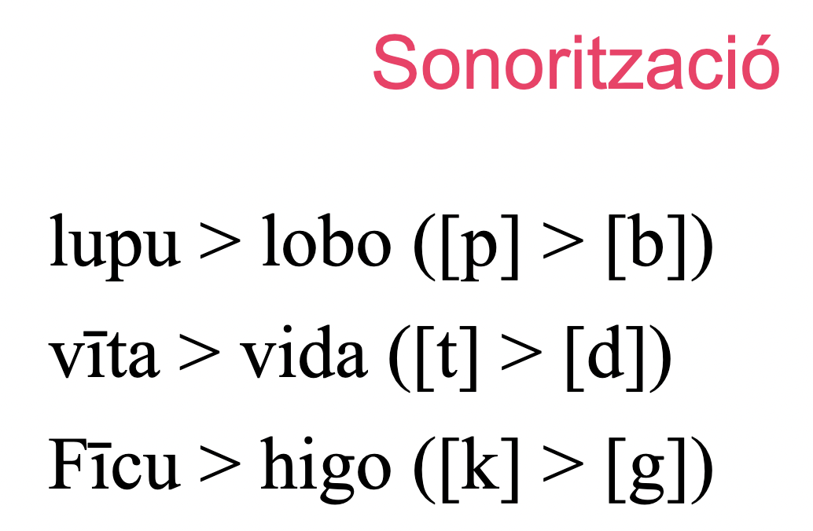
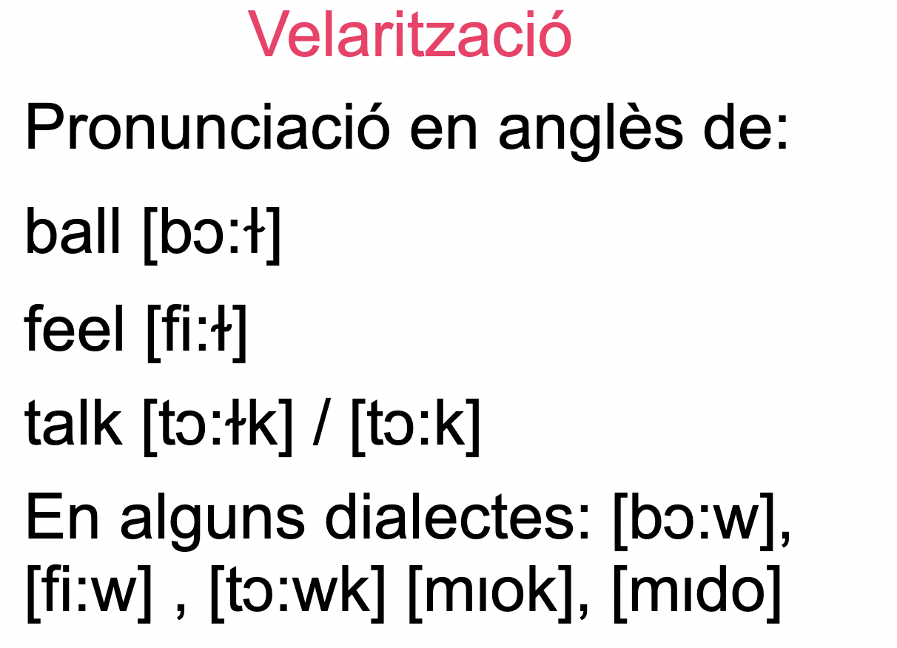
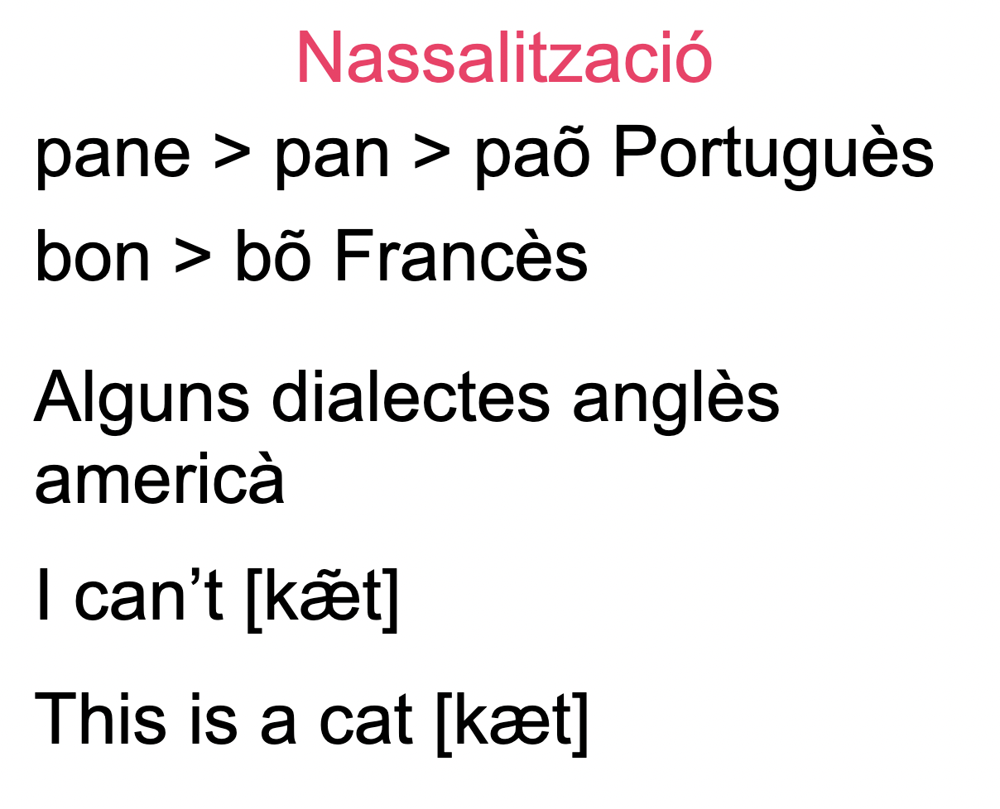
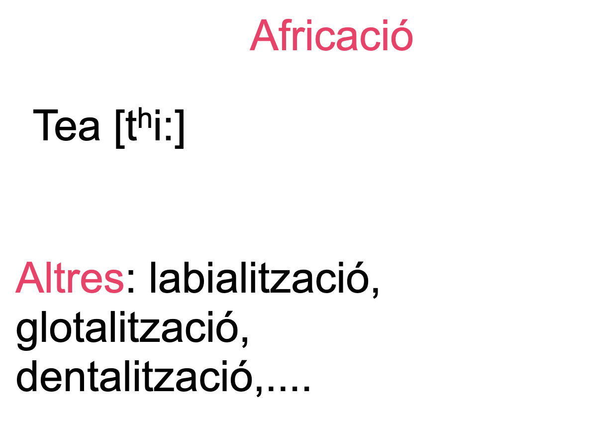

```{r preamble, echo=FALSE, message=FALSE, warning=FALSE}
library(dplyr)
library(ggplot2)
```


<br><br><br><br>
<div class="warning" style='padding:0.1em; background-color:#E9D8FD; color:#69337A'>
<span>
<p style='margin-top:1em; text-align:center'>
<b>Què és la fonètica?</b>
</p>
</p></span>
</div>

---


<br><br><br><br>
<div class="warning" style='padding:0.1em; background-color:#E9D8FD; color:#69337A'>
<span>
<p style='margin-top:1em; text-align:center'>
<b>Quines tres disciplines importants de fonètica hi ha? Què estudia cadascuna?</b>
</p>
</p></span>
</div>


---


<br><br><br><br>
<div class="warning" style='padding:0.1em; background-color:#E9D8FD; color:#69337A'>
<span>
<p style='margin-top:1em; text-align:center'>
<b>Amb quines tres propietats articulatòries es poden definir un consonant?</b>
</p>
</p></span>
</div>

---


---


<br><br><br><br>
<div class="warning" style='padding:0.1em; background-color:#E9D8FD; color:#69337A'>
<span>
<p style='margin-top:1em; text-align:center'>
<b>Quina diferència hi ha entre una consonant i una vocal?</b>
</p>
</p></span>
</div>


---

# Vocals





---

# Vocals




---

# Repàs de símbols més importants per al curs

https://raw.githubusercontent.com/brochhagen/l2-upf/master/2023q3/IPA_chart_oficial_assignatura.pdf


---

# AFI/IPA sencera

https://raw.githubusercontent.com/brochhagen/l2-upf/master/2023q3/Alfabet_IPA_amb_Africades_2021.pdf

https://www.ipachart.com/


---

# Nota sobre consens d'inventoris


[https://joaquimllisterri.cat/](https://joaquimllisterri.cat/)


---


<br><br><br><br>
<div class="warning" style='padding:0.1em; background-color:#E9D8FD; color:#69337A'>
<span>
<p style='margin-top:1em; text-align:center'>
<b>Transcriu les paraules següents (en el teu dialecte):</b><br>

<li> sac (cat) </li>
<li> entens (cat) </li>
<li> abans (cat) </li>
<li> xec (cat) </li>
<li> mig (cat) </li>
</p>
</p></span>
</div>

---


<br><br><br><br>
<div class="warning" style='padding:0.1em; background-color:#E9D8FD; color:#69337A'>
<span>
<p style='margin-top:1em; text-align:center'>
<b>Transcriu les paraules següents (en el teu dialecte):</b><br>

<li> perro (cast) </li>
<li> niño (cast) </li>
<li> llave (cast) </li>
<li> hámster (cast) </li>
<li> zorro (cast) </li>
</p>
</p></span>
</div>


---

* Per als exercicis avaluats automàticament, utilitzeu la pàgina web per copiar/enganxar símbols: https://jmfontana.github.io/ipa-chart-phono-rules/phonology/keyboard/index.html

---


class: center, inverse

# Processos fonètics

---

<br><br><br><br>
<div class="warning" style='padding:0.1em; background-color:#E9D8FD; color:#69337A'>
<span>
<p style='margin-top:1em; text-align:center'>
<b>La mateixa &lt;b>?</b><br>
<li>submarí vs. subsegüent</li>
</p>
</p></span>
</div>

---

* su[bm]arí (de fet [βm] o [mm])

* su[ps]egüent

---

# Assimilació parcial i total

* &lt;Cangrejo> $\Rightarrow$ [kaŋgrexo]

* &lt;handbag> $\Rightarrow$ [hæmbæg]

* &lt;in Paris> $\Rightarrow$ [ɪm pærɪs]

<br><br>

* lat: &lt;octo> $\rightarrow$ it: &lt;otto>

---

# Assimilació a distancia / harmonia vocal

* &lt;Kind> / [kint] $\Rightarrow$ &lt;Kinder> / [kinda] 
<br><br>

* Alt. Hoch Dt.: &lt;Gast> $\Rightarrow$ &lt;Gasti>

* Dt.: &lt;Gast> / [gast] $\Rightarrow$  &lt;Gäste> / [gɛstə]

---



---



---



---



---



---



---

# (In)estabilitat dels sistemes vocàlics
# (des)equilibri espai fonològic

.pull-left[
* Basc

* Italià

* Espanyol
]

.pull-right[ 
* Anglès

* Francès]

---


<br><br><br><br>
<div class="warning" style='padding:0.1em; background-color:#E9D8FD; color:#69337A'>
<span>
<p style='margin-top:1em; text-align:center'>
L'evolució de la fonètica de les llengües del món té direccionalitat?
</p>
</p></span>
</div>

---


class: inverse
# Propera sessió

* Practica 1: Fonètica

* Qüestionari de lectura (fonologia 1a)


***

* **Fonologia: Conceptes bàsics**
