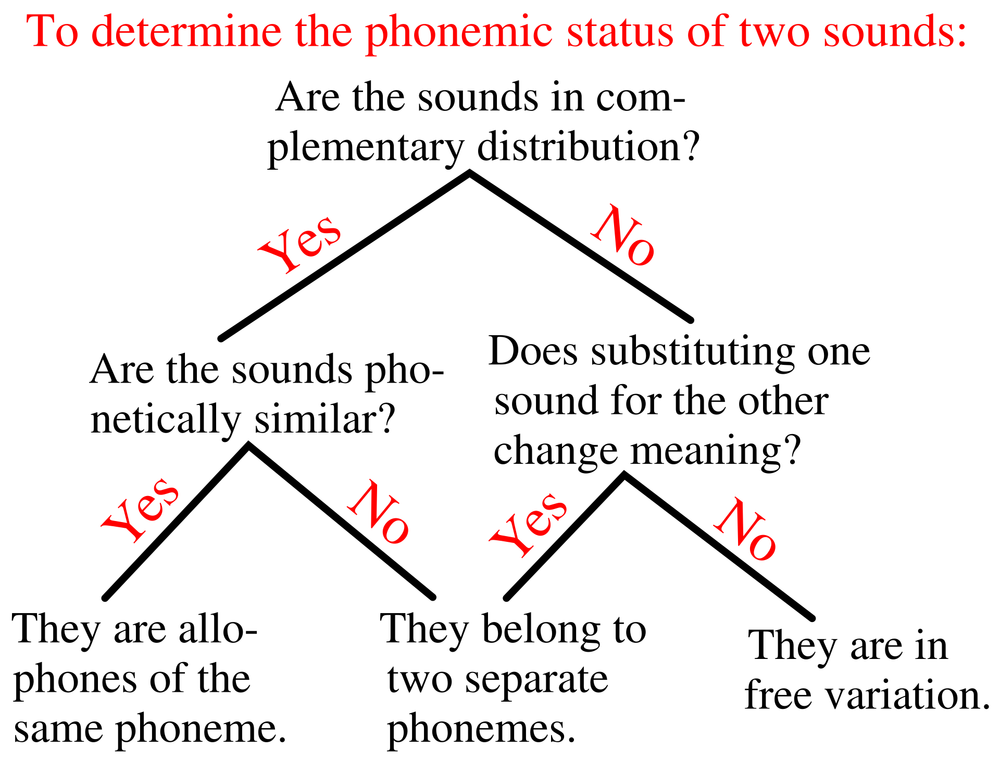

```{r preamble, echo=FALSE, message=FALSE, warning=FALSE}
library(dplyr)
library(ggplot2)
```


# Terminologia

.pull-left[

* Bilabials
  
* Labiodentals
  
* Dentals
  
* (Post-)alveolars
  
* Retroflexes
  
* Palatals
  
* Velars
  
* Uvulars
    
* Glotals
]

.pull-right[
* Oclusiva

* Nasal

* Vibrant

* Bategant

* Fricativa

* Aproximant

* Africada

]

---

<br><br><br><br>
<div class="warning" style='padding:0.1em; background-color:#E9D8FD; color:#69337A'>
<span>
<p style='margin-top:1em; text-align:center'>
<b>Què és la fonologia?</b><br><b>Com es diferencia de la fonètica?</b>
</p>
</p></span>
</div>

---

# Fonologia 

.large[

<br><br>
l'estudi de les unitats mínimes que componen un llenguatge; com s'organitzen; i com es relacionen 

]

---

<br><br><br><br>
<div class="warning" style='padding:0.1em; background-color:#E9D8FD; color:#69337A'>
<span>
<p style='margin-top:1em; text-align:center'>
<b>Quins factors influeixen que dues llengües sonen diferent?</b>
</p>
</p></span>
</div>


---

# No totes les llengües utilitzen els mateixos sons


* castellà: 5 vocals

* anglès: 10 vocals

.footnote[
*** 
Això de contar vocals *en una llengua* és una simplificació. Com ho és parlar d'*una llengua* en primer lloc.
]

---

# No totes les llengües utilitzen els sons de la mateixa manera

* castellà: [ð] no contrastiu

* anglès: [ð] contrastiu


---


# No totes les llengües utilitzen els sons de la mateixa manera

* castellà: [ð] no contrastiu

  * *lado* [lado] / [laðo]
  * *Madrid* [madrid] / [madrið]
  
--

* anglès: [ð] contrastiu

  * *breed* [bri:d] vs. *breathe* [bri:ð]

---


# No totes les llengües utilitzen els sons de la mateixa manera

* castellà: [ð] no contrastiu

  * *lado* [lado] / [laðo]
  * *Madrid* [madrid] / [madrið]
  
  * $\Rightarrow$ ð/d són variants de la realització de la mateixa unitat discriminativa

--

* anglès: [ð] contrastiu

  * *breed* [bri:d] vs. *breathe* [bri:ð]
  
  * $\Rightarrow$ [ð] i [d] són fonémes de l'anglès

---

# Fonemes i al·lòfons


**Fonema**: Una classe de sons/fones que tractem com si fossin el mateix so (la mateixa unitat discriminativa en una llengua particular)

fonemes són abstraccions

---

Castellà:

  * Dani: [dani], *[ðani]
  
  * a Dani: [aðani] / [adani]
  
$\Rightarrow$ [d], [ð] són al·lòfons del fonema /d/ en castellà

---


<br><br><br><br>
<div class="warning" style='padding:0.1em; background-color:#E9D8FD; color:#69337A'>
<span>
<p style='margin-top:1em; text-align:center'>
<b>Llavors, què és un al·lòfon?</b>
</p>
</p></span>
</div>

---

**Al·lòfons**: Realitzacions de la mateixa unitat discriminativa; no discriminen significats entre si; tenen propietats fonètiques semblants; tenen una distribució complementària

---


<br><br><br><br>
<div class="warning" style='padding:0.1em; background-color:#E9D8FD; color:#69337A'>
<span>
<p style='margin-top:1em; text-align:center'>
<b>Per què, en castellà, són [d] i [ð] al·lòfons de /d/  i no de /ð/?</b>
</p>
</p></span>
</div>

---

Anglès:

* breed: [bri:d]

* breathe: [bri:ð]

$\Rightarrow$ [d], [ð] no són al·lòfons del mateix fonema anglès

--

$\Rightarrow$ [d] és un al·lòfon de /d/

$\Rightarrow$ [ð] és un al·lòfon de /ð/

---

# Entendre el sistema de sons d’una llengua...

...és entendre:

* quins són els fonemes

* per a cada fonema, quins son els al·lòfons

* quan es fa servir cada al·lòfon

---

# Les distribucions dels sons
### Distribució contrastiva vs. distribució complementària

Els sons amb distribució contrastiva no poden intercanviar-se
sense canvi de significat.

* *sé* [se] vs. *sí* [si] vs. *sú* [su]

* *bee* [bi:] vs. *see* [si:] vs. *knee* [ni:]

--

Dos sons en distribució contrastiva pertanyen a fonemes
diferents.

--

Identifiquem sons en distribució contrastiva via parells
mínims

---

<br><br><br><br>
<div class="warning" style='padding:0.1em; background-color:#E9D8FD; color:#69337A'>
<span>
<p style='margin-top:1em; text-align:center'>
<b>Busca 12 fonèmes de una llengua de la teva elecció. 8 que es realitzin com a consonants i 4 com a vocals.</b>
</p>
</p></span>
</div>


---

# Les distribucions dels sons
### Distribució contrastiva vs. distribució complementària

Sons amb distribució complementària no aparèixen al mateix
context.

* *coop* (anglès): [kʰup] / *[kup]
--

* *scoop* (anglès): *[skʰup] / [skup]

--

Dos sons en distribució complementària pertanyen al mateix fonema.

$\Rightarrow$ [kʰ] i [k] són al·lòfons de /k/ en anglès

---

<br><br><br><br>
<div class="warning" style='padding:0.1em; background-color:#E9D8FD; color:#69337A'>
<span>
<p style='margin-top:1em; text-align:center'>
<b>Busca 6 al·lòfons en distribució complementària de una llengua de la teva elecció</b>
</p>
</p></span>
</div>


---

# Les distribucions dels sons

Sons en variació lliure poden aparèixer al mateix context sense canvi de significat

---

<br><br><br><br>
<div class="warning" style='padding:0.1em; background-color:#E9D8FD; color:#69337A'>
<span>
<p style='margin-top:1em; text-align:center'>
<b>Busca 6 al·lòfons en distribució lliure de una llengua de la teva elecció</b>
</p>
</p></span>
</div>


---



.footnote[
*** 
Wikipedia article on *Allophone*: https://en.wikipedia.org/wiki/Allophone
]

---

# Classes naturals

Conjunt de fonemes en una llengua que comparteixen determinades característiques distintives

* [-continuant] [-voice]

---

<br><br><br><br>
<div class="warning" style='padding:0.1em; background-color:#E9D8FD; color:#69337A'>
<span>
<p style='margin-top:1em; text-align:center'>
<b>En el conjunt de segments que s'enumeren a continuació, quin segment s'ha d'excloure perquè els segments restants constitueixin una classe natural?</b>
<br><br>
1. [i]; [e]; [æ]; [o]; [u]
<br><br>
2. [p]; [f]; [t]; [k]

</p>
</p></span>
</div>


---

# Restriccions fonotàctiques

Restriccions de com es combinen els sons d'una llengua

Alguns sons no poden aparèixer a l'inici d'una paraula

* [ʒ] o [ŋ] en anglès (*Jacques* o *Nguyen*)

* /s/+C en castellà (p.e. *Spain* o *still*)


---

# Restricciones fonotàctiques

Preferències i restriccions en estructures sil·làbiques

* Anglès: V, VC, CV, ..., CCCVCCC (*strengths*)

* Hawaià: CV, V

---

class: inverse
# Propera sessió

* Practica 2: Fonologia

* Qüestionari de lectura (fonologia 2a)


***

* **Fonologia: Com representar processos fonològics**
