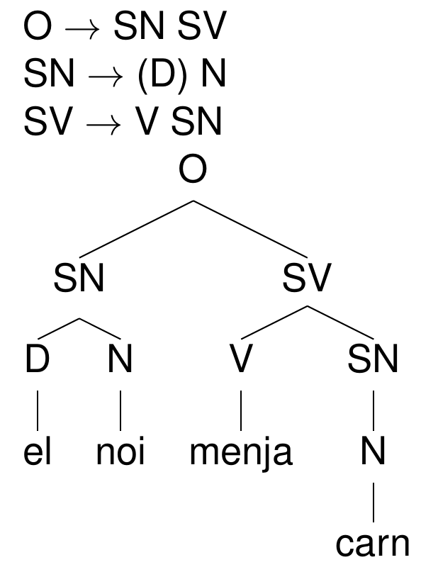

```{r preamble, echo=FALSE, message=FALSE, warning=FALSE}
library(dplyr)
library(ggplot2)
```

# Avui

* Les categories lèxiques

* Els constituents i l’estructura jeràrquica

* Els papers temàtics.

* Els constituents i com identificar-los.

* La tipologia de l’ordre de constituents.


---

# Les categories lèxiques

* Per què els filòlegs van inventar categories com Nom, Verb, Adjectiu, Adverbi, Preposició, Determinant, Conjunció, Pronom, o Verb auxiliar?

--

* Quantes categories lèxiques hi ha? Quines són?

--

* Com sabem si una paraula és un Nom, Verb, etc.?

***

--

**La sintaxi:** Les regles que ens diuen com poden combinar-se
diferents categories lèxiques d’una llengua per formar
[sintagmes]() i [oracions gramaticals]() d’aquella llengua de manera
que puguin ser interpretades correctament des d’un punt de
vista semàntic.

---

# Les categories lèxiques

De quines categories lèxiques és la paraula **cap**?
<br><br><br>

* Em fa mal el **cap**.

* La maleta no hi **cap**, al maleter.

* Posa’t **cap** a la dreta.

* No he vist **cap** nen.

--
<br><br><br>
.Large[
Com ho saps?
]
---

# Els constituents i l’estructura jeràrquica


* Algunes seqüències de paraules formen sintagmes, que
formen part d’altres sintagmes.

* La sintaxi és recursiva.


**Ell** ha parlat.

**El noi** ha parlat.

**El noi amb el cabell roig** ha parlat.

**El noi que va veure el noi amb el cabell roig** ha parlat.

...

---

# Els constituents i l’estructura jeràrquica

L’estructura reflecteix el significat.


---

class: inverse

# Claudàtor-gate

---

# L’ordre de les paraules

He llegit el llibre blanc.

?He llegit el blanc llibre.

<br>
\*I read the book white

I read the white book

<br>
Ha trucat la Marta.

La Marta ha trucat.

<br>
\*Has called Marta.

Marta has called.

---

#Unmarked SV order in intransitive sentences


.footnote[
https://grambank.clld.org/parameters/GB130#2/8.1/168.0

Groc: SV; blau: VS; tarronja/marró: les dos 

]

---

# La concordança


La profe ets/\*és tu.

The professor is/\*are you.

<br>
El vi blanc / La farina blanca / Els vins blancs

White wine / White flour / white(\*s) wines

<br>
El seu amic / Els seus amics.

His friend / Their friends.


---


<br><br><br><br>
<div class="warning" style='padding:0.1em; background-color:#E9D8FD; color:#69337A'>
<span>
<p style='margin-top:1em; text-align:center'>
<b>Per què algunes paraules admeten un plural i altres no?<br><br>*happynesses; ?waters; ?sands; *Möbel-s/er/...</b>
</p>
</p></span>
</div>


---

# Does article agree with noun in number? 


.footnote[
https://grambank.clld.org/parameters/GB186#2/35.2/103.7

Verd: no agreement; groc: agreement
]

---

# Les categories lèxiques

* Cauen en dos grups: “obertes” i “tancades”

--

* Les definim segons les seves propietats sintàctiques, no segons el tipus de concepte que designen.

--

* Verb vs. Nom (e.g. descubrir /descubriment), Adverbi vs. Conjunció (e.g. although/but)

--

* Tot i què hi ha moltes similituds, hi ha una variació considerable entre les categories que trobem a les llengües del món.
  - *Salish* (Washington State, EUA, British Columbia, CA): sense la distinció Nom/Verb?

  - *Achenese* (Sumatra): sense la distinció Adjectiu/Verb?

---

# La interfície sintaxi-semàntica

* Gramaticalitat = adequació/tenir significat?

--

* Codificació dels rols del participants en una situació descrita amb una oració: com sabem qui fa què?

  * Funció gramatical (subjecte, objecte directe, etc.)
  
  * Paper temàtic (agent, pacient, instrument, tema (pateix moviment o canvi, o simplement té una propieitat), origen, recipient, experimentador)

* La representació de funcions gramaticals varia d’una llengua a l’altra (ordre de constituents, cas morfològic, preposicions)

---

# Els papers temàtics

* [agent](): qui fa l’acció

* [pacient](): qui rep l’acció

* [tema](): pateix moviment o canvi, o simplement té una propieitat

* [instrument](): objecte que s’utilitza per fer una acció

* [origen](): on comença un canvi de lloc o possessió

* [recipient](): on acaba un canvi de lloc o possessió

* [experimentador](): persona que percep o sent alguna cosa


---

<br><br><br><br>
<div class="warning" style='padding:0.1em; background-color:#E9D8FD; color:#69337A'>
<span>
<p style='margin-top:1em; text-align:center'>
<b>Troba un exemple per paper temàtic </b>
</p>
</p></span>
</div>

---

# Els papers temàtics

**En Joan** va crèixer.

**La Susanna** va obrir la porta amb **una clau**.

**En Fran** ha venut **el cotxe**.

**L’Anna** creu que té raó.

**La caixa** està oberta.

**La borsa** ha tocat **fons**.

**El nen** ha tocat **el gat**.

---
# Els constituents

[Sintagmes nominals](): El nom és el **nucli**.


**Pare**

el **pare**

el **pare** d’en Max

el **pare** jove

el **pare** que té dos fills

el **pare** jove que té dos fills

el **pare** jove amb ulleres que té dos fills

---

# Els constituents

[Sintagmes verbals](): El **verb** és el nucli.

**menja**

**menja** tofu

**menja** amb una forquilla

**menja** tofu amb una forquilla

---

# Els constituents

[Sintagmes preposicionals]():  La preposició és el nucli.

**de** la Maria

**amb** ganes

**a** un minut

**sota** tres dels arbres

---

# Els arbres i les regles d’estructura



---

# Com identificar-los

El noi [ [menja] [la carn] [amb una forquilla]].

--

* Substitució per un pronom: El noi la menja (amb una forquilla).

* Moviment: La carn sí que menja el noi (amb una forquilla).

* Preguntes: Què ha menjat el noi (amb una forqilla)? La carn.

---

<br><br><br><br>
<div class="warning" style='padding:0.1em; background-color:#E9D8FD; color:#69337A'>
<span>
<p style='margin-top:1em; text-align:center'>
<b>Especifica l'arbre sintàctic de les frases següents</b>
<br><br><br>

<li> El noi menja tofu amb una forquilla. </li>
<li> Som traductors de pel·lícules de Hollywood. </li>
<li> Sobre la casa va caure l'arbre vell. </li>


</p>
</p></span>
</div>


---

# Altres teories

* Arbres no binaris

* Altres papers temàtics

* Altres tipus de dependències


---

class: inverse
# Propera sessió

* Practica 5: Sintaxi 1 

* 2a lectura de sintaxi i questionari 


***

* Segona prova pràctica puntuable (morfologia i sintaxi): 14/06